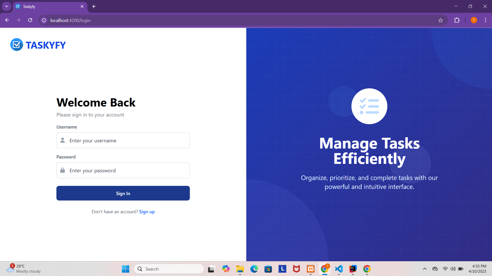
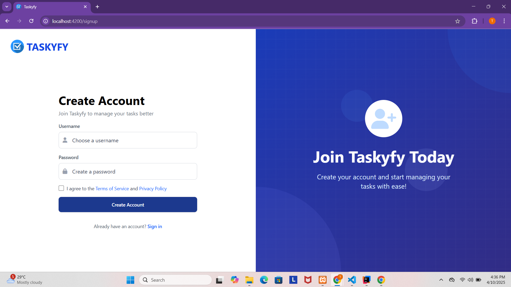
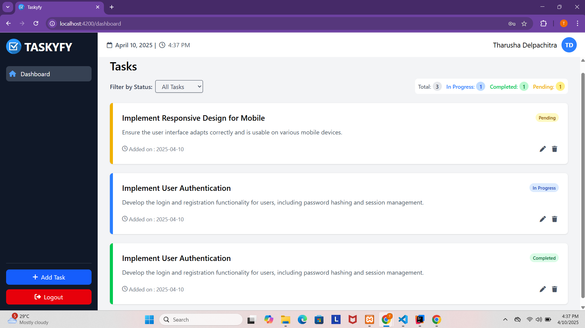

## Full Stack Task Manager App 

This section provides instructions on how to run the Angular frontend, Spring Boot backend, and MySQL database separately on your local machine.

### Prerequisites

Ensure you have the following installed in addition to the prerequisites mentioned for Docker:

* **Java Development Kit (JDK):** Version **17** or a compatible later version is required for the Spring Boot backend.
* **Node.js and npm (or yarn):** Required for running the Angular frontend. Ensure you have a recent version installed. Based on your `package.json`, you are using **Angular 19**. You can download Node.js from [nodejs.org](https://nodejs.org/). npm usually comes bundled with Node.js.
* **Maven or Gradle:** Build tools for the Spring Boot project (depending on how your backend is configured).downloads/).

### Setting up MySQL

1.  **Install MySQL Server:** If you haven't already, install the MySQL server on your system.


### Running the Spring Boot Backend

1.  **Navigate to the Backend Directory:**
    ```bash
    cd backend
    ```
2.  **Configure Environment Variables (JWT Secret):**
    * Your Spring Boot backend uses a `JWT_SECRET` for signing and verifying JWT tokens. **This secret should be kept confidential.**
    * **For local development , you need to provide this secret to your Spring Boot application.** A common way to do this is by creating a `.env` file in the root of your `backend` directory (next to your `pom.xml` or `build.gradle` file) and adding the following line:

        ```
        JWT_SECRET=your_secure_secret_key
        ```

        Replace `your_secure_secret_key` with a strong, unique value. Your Spring Boot application should be configured to read this environment variable.

    * **Alternatively**, you can set the `JWT_SECRET` environment variable directly in your operating system's shell or within your IDE's run configuration.


2.  **Configure Database Connection:** Ensure your Spring Boot application is configured to connect to your local MySQL database using the credentials you set up. This is typically done in the `src/main/resources/application.properties` or `application.yml` file. You'll need to set properties like: (Change the user name and password of your local database)
    ```properties
    spring.datasource.url=jdbc:mysql://localhost:3306/Task_app_db?createDatabaseIfNotExist=true
    spring.datasource.username=your_backend_user
    spring.datasource.password=your_backend_password
    spring.datasource.driver-class-name=com.mysql.cj.jdbc.Driver

    spring.jpa.hibernate.ddl-auto=update 
    spring.jpa.show-sql=true
    spring.jpa.properties.hibernate.dialect=org.hibernate.dialect.MySQL8Dialect
    ```
    
3.  **Run the Backend Application:** Use your chosen build tool to run the Spring Boot application:
    * **Maven:**
        ```bash
        ./mvnw spring-boot:run
        ```
        (or `mvn spring-boot:run` if you have Maven installed globally)

4.  **Verify Backend Startup:** Wait for the Spring Boot application to start. You should see logs indicating that it has started successfully and is listening on port `8080` .

### Running the Angular Frontend

1.  **Navigate to the Frontend Directory:**
    ```bash
    cd frontend
    ```
2.  **Install Dependencies:** If you haven't already, install the Angular project's dependencies:
    ```bash
    npm install
    # or
    yarn install
    ```
3.  **Start the Angular Development Server:**
    ```bash
    ng serve 
    # or
    npm start
    # or
    yarn start
    ```
    This command will build the Angular application and start a development server, typically accessible at `http://localhost:4200` in your web browser. 

### Accessing the Application

Once both the frontend and backend are running:

* **Frontend:** Navigate to `http://localhost:4200` in your web browser.
* **Backend API:** The Spring Boot backend API will be accessible at `http://localhost:8080`. You can use tools like Postman or `curl` to interact with its endpoints.
* **MySQL:** Your Spring Boot application will connect to the MySQL database running on `localhost:3306` using the credentials configured in your `application.properties` or `application.yml` file.

## Application Screenshots

Here are some screenshots of the Task Manager application:

### Login Page



This is the login screen where users can access their accounts.

---

### Sign Up Page



New users can create an account using the sign-up page.

---

### Dashboard



This is the main dashboard view, displaying the user's tasks, categories, and other relevant information.

---

### Add Task Form


Users can add new tasks to their list using this form.